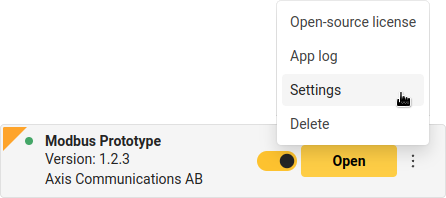

*Copyright (C) 2023, Axis Communications AB, Lund, Sweden. All Rights Reserved.*

# Modbus ACAP

[](https://github.com/AxisCommunications/modbus-acap/actions/workflows/build.yml)
[](https://github.com/AxisCommunications/modbus-acap/actions/workflows/super-linter.yml)

This repository contains the source code to build a small prototype
[ACAP version 3](https://help.axis.com/acap-3-developer-guide)
application that exports events from
[AXIS Object Analytics](https://www.axis.com/products/axis-object-analytics)
(AOA) over
[Modbus](https://en.wikipedia.org/wiki/Modbus) using
[libmodbus](https://libmodbus.org/). The ACAP can be run in either server or
client mode, meaning two Axis devices can be used to showcase it.


*The purpose of this repo is to serve as boilerplate code and keep things
simple, hence it uses basic Modbus/TCP without TLS and such.*

## Build

The build step creates `eap` (embedded application package) packages that can
then be deployed on the target Axis device e.g. via the device's web UI.

*For more information about the `eap` files, their content, and other ways to
deploy, please see the
[ACAP Developer Guide](https://help.axis.com/acap-3-developer-guide).*

### On developer computer with ACAP SDK installed

```sh
# With the environment initialized, use:
acap-build .
```

### Using ACAP SDK build container and Docker

The handling of this is integrated in the [Makefile](Makefile), so if you have
Docker and `make` on your computer all you need to do is:

```sh
make dockerbuild
```

or perhaps build in parallel:

```sh
make -j dockerbuild
```

If you do have Docker but no `make` on your system:

```sh
# 32-bit ARM, e.g. ARTPEC-6- and ARTPEC-7-based devices
DOCKER_BUILDKIT=1 docker build --build-arg ARCH=armv7hf -o type=local,dest=. .
# 64-bit ARM, e.g. ARTPEC-8-based devices
DOCKER_BUILDKIT=1 docker build --build-arg ARCH=aarch64 -o type=local,dest=. .
```

## Setup

### Manual installation and configuration

Upload the ACAP file (the file with the `.eap` extension for the camera's
architecture) through the camera's web UI: *Apps->Add app*

The parameter settings are found in the three vertical dots menu:




Select if the ACAP should run in Server or Client mode and what AOA scenario's
events it should subscribe to (default: Scenario 1). If you run in Client
mode, also make sure you have set the right hostname/IP address for the Modbus
server you want to send the events to.

### Scripted installation and configuration

Use the camera's
[applications/upload.cgi](https://www.axis.com/vapix-library/subjects/t10102231/section/t10036126/display?section=t10036126-t10010609)
to upload the ACAP file (the file with the `.eap` extension for the camera's
architecture):

```sh
curl -k --anyauth -u root:<password> \
    -F packfil=@Modbus_Prototype_<version>_<architecture>.eap \
    https://<camera hostname/ip>/axis-cgi/applications/upload.cgi
```

To
[start (or stop/restart/remove)](https://www.axis.com/vapix-library/subjects/t10102231/section/t10036126/display?section=t10036126-t10010606)
the ACAP, you can make a call like this:

```sh
curl -k --anyauth -u root:<password> \
    'https://<camera hostname/ip>/axis-cgi/applications/control.cgi?package=modbusacap&action=start'
```

Use the camera's
[param.cgi](https://www.axis.com/vapix-library/subjects/t10175981/section/t10036014/display)
to list and set the ACAP's parameters:

The call

```sh
curl -k --anyauth -u root:<password> \
    'https://<camera hostname/ip>/axis-cgi/param.cgi?action=list&group=modbusacap'
```

will list the current settings:

```sh
root.Modbusacap.Mode=0
root.Modbusacap.Scenario=1
root.Modbusacap.Server=172.25.75.172
```

If you want to set the server to e.g. 192.168.42.21:

```sh
curl -k --anyauth -u root:<password> \
    'https://<camera hostname/ip>/axis-cgi/param.cgi?action=update&root.Modbusacap.Server=192.168.42.21'
```

## Usage

The ACAP can be run in either client mode or server mode (default), configured
with the application parameter `Mode`:

In client mode, it will subscribe to
[AXIS Object Analytics](https://www.axis.com/products/axis-object-analytics)
(AOA) events for the AOA scenario specified in the application parameter
`Scenario` (default: Scenario 1) and send the trigger status (active/inactive)
over Modbus (TCP) to the Modbus server running on the host set in the ACAP's
parameter `Server`.

In server mode, it will listen for incoming TCP requests and print incoming
AOA status updates to the application log.

***NB!** The default Modbus/TCP port 502 requires running as a privileged user.
In order to run as a non-privileged user, this ACAP only allows ports in the
non-privileged range 1024–65535.*

## License

[Apache 2.0](LICENSE)
