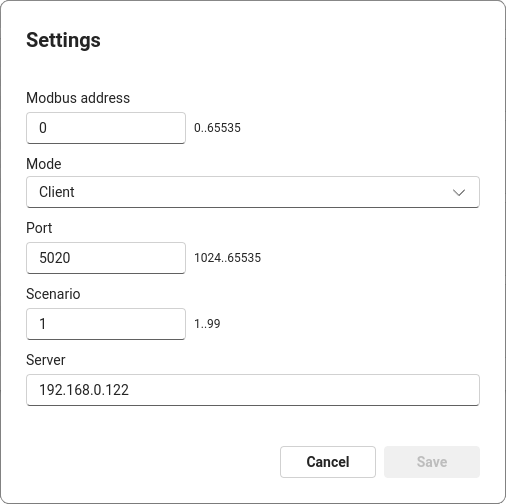

*Copyright (C) 2024, Axis Communications AB, Lund, Sweden. All Rights Reserved.*

# Modbus ACAP

[](https://github.com/AxisCommunications/modbus-acap/actions/workflows/build.yml)
[](https://github.com/AxisCommunications/modbus-acap/actions/workflows/super-linter.yml)

This repository contains the source code to build a small prototype
[ACAP version 4](https://axiscommunications.github.io/acap-documentation/)
(native) application that exports events from
[AXIS Object Analytics](https://www.axis.com/products/axis-object-analytics)
(AOA) over
[Modbus](https://en.wikipedia.org/wiki/Modbus) using
[libmodbus](https://libmodbus.org/). The application can be run in either server
or client mode, meaning two Axis devices can be used to showcase it.


> [!NOTE]
> The purpose of this repo is to serve as boilerplate code and keep
> things simple, hence it uses basic Modbus/TCP without TLS and such.

## Build

The build step creates `eap` (embedded application package) packages that can
then be deployed on the target Axis device e.g. via the device's web UI.

*For more information about the `eap` files, their content, and other ways to
deploy, please see the documentation on how to
[Develop ACAP applications](https://axiscommunications.github.io/acap-documentation/docs/develop/).*

The build uses [Docker](https://www.docker.com/) and the containerized ACAP SDK.
If you have `make` on your computer the Docker commands are nicely wrapped in
the [Makefile](Makefile). All you need to do then is:

```sh
make dockerbuild
```

or perhaps build in parallel:

```sh
make -j dockerbuild
```

If you do have Docker but no `make` on your system:

```sh
# 32-bit ARM, e.g. ARTPEC-6- and ARTPEC-7-based devices
DOCKER_BUILDKIT=1 docker build --build-arg ARCH=armv7hf -o type=local,dest=. .
# 64-bit ARM, e.g. ARTPEC-8-based devices
DOCKER_BUILDKIT=1 docker build --build-arg ARCH=aarch64 -o type=local,dest=. .
```

## Setup

### Manual installation and configuration

Upload the ACAP application file (the file with the `.eap` extension for the
camera's architecture) through the camera's web UI: *Apps->Add app*

The parameter settings are found in the three vertical dots menu:




Select if the application should run in Server or Client mode and what AOA scenario's
events it should subscribe to *(default: Scenario 1)*. If you run in Client
mode, also make sure you have set the right hostname/IP address for the Modbus
server you want to send the events to.

Use the Modbus address parameter to select what Modbus bit to use for state if
the event is active or inactive.

### Scripted installation and configuration

Use the camera's
[applications/upload.cgi](https://www.axis.com/vapix-library/subjects/t10102231/section/t10036126/display?section=t10036126-t10010609)
to upload the ACAP application file (the file with the `.eap` extension for the
camera's architecture):

```sh
curl -k --anyauth -u root:<password> \
    -F packfil=@Modbus_Prototype_<version>_<architecture>.eap \
    https://<camera hostname/ip>/axis-cgi/applications/upload.cgi
```

To
[start (or stop/restart/remove)](https://www.axis.com/vapix-library/subjects/t10102231/section/t10036126/display?section=t10036126-t10010606)
the ACAP, you can make a call like this:

```sh
curl -k --anyauth -u root:<password> \
    'https://<camera hostname/ip>/axis-cgi/applications/control.cgi?package=modbusacap&action=start'
```

Use the camera's
[param.cgi](https://www.axis.com/vapix-library/subjects/t10175981/section/t10036014/display)
to list and set the application's parameters:

The call

```sh
curl -k --anyauth -u root:<password> \
    'https://<camera hostname/ip>/axis-cgi/param.cgi?action=list&group=modbusacap'
```

will list the current settings:

```sh
root.Modbusacap.Mode=0
root.Modbusacap.Scenario=1
root.Modbusacap.Server=172.25.75.172
```

If you want to set the server to e.g. 192.168.42.21:

```sh
curl -k --anyauth -u root:<password> \
    'https://<camera hostname/ip>/axis-cgi/param.cgi?action=update&root.Modbusacap.Server=192.168.42.21'
```

## Usage

> [!IMPORTANT]
> The default Modbus/TCP port 502 requires running as a privileged user.
> In order to run as a non-privileged user, this ACAP application only allows
> ports in the non-privileged range 1024–65535.

> [!IMPORTANT]
> The Modbus address parameter must be set to the same value for both the
> client and the receiving server.

The application can be run in either *client* mode (default) or *server* mode,
configured with the application parameter `Mode`:

### Client mode (default)


The application subscribes to
[AXIS Object Analytics](https://www.axis.com/products/axis-object-analytics)
(AOA) events for the specified scenario *(default: Scenario 1)* and sends
trigger status *(active/inactive)* over Modbus (TCP) to the server specified
in the application configuration. **This the typical use case** where the Axis
device pushes AOA events to a receiving Modbus device.

### Server mode


In server mode, the application listens for incoming TCP requests and logs AOA
status updates from a connected device running in client mode. **This mode is
useful for testing and debugging without a separate Modbus device.**
*In server mode, the application also subscribes to AOA events from its host
device, but does not send them anywhere. That is solely for easy debugging and
testing the application's subscription mechanism.*

## License

[Apache 2.0](LICENSE)
